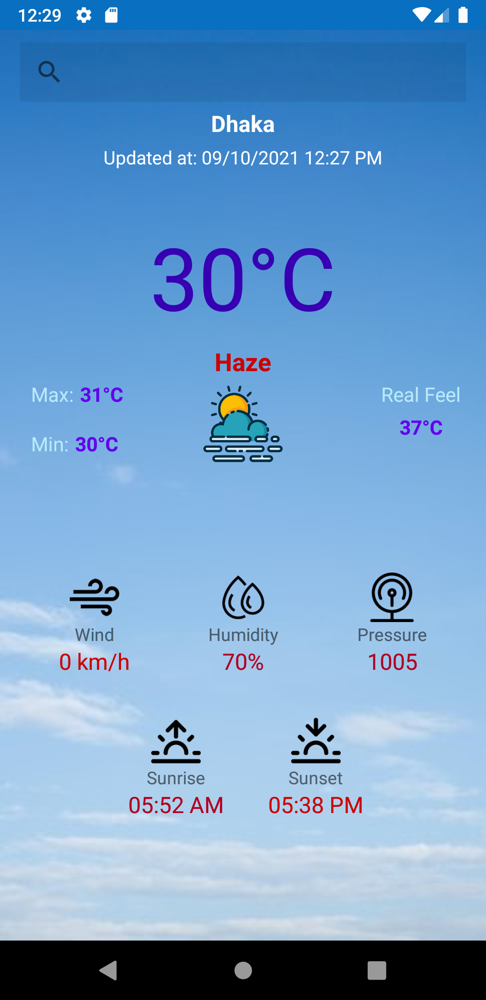
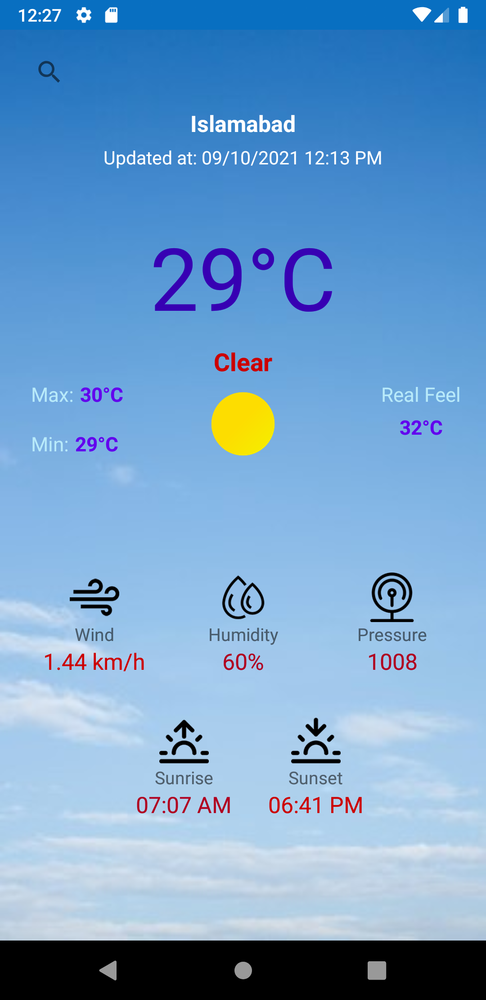
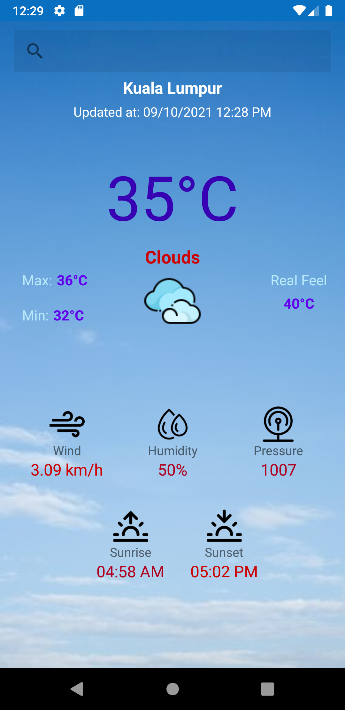

# Weather-App-Android-Kotlin
A weather app which gives updated weather information for a particular location.

  
  

 

---

> API: OpenWeatherMap

---

### Features

- Temperature in degree celcius
- Weather description along with image
- Max and Min Temperature 
- Wind Speed
- Humidity
- Pressure
- Sunrise and Sunset
- SearchView to get weather info for a particular location.
- Location tracking using GPS (In Progress)
- Forecast weather for the upcoming days (In Progress)

 

---
